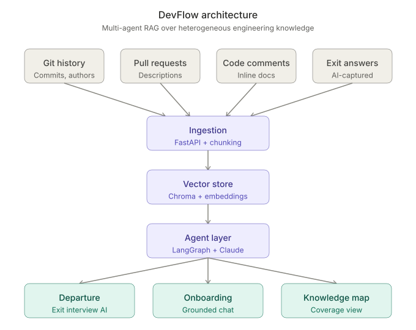

# DevFlow

> **Engineering knowledge shouldn't leave with engineers.**

**1st Place — From Prototype to Product: AI Workshop & Hackathon**
*Northeastern University · March 14, 2026*

---

## The Problem

When an engineer leaves a team, the code stays — but the *why* leaves with them.

Workarounds, architectural decisions, client quirks, edge cases discovered at 2 AM — all of it lives in one person's head. Their replacement spends weeks doing Slack archaeology, reading stale wiki pages, and interrupting senior engineers with questions that already have answers somewhere.

Existing code-intelligence tools (Greptile, Sourcegraph Cody, Augment Code) answer **"what does this code do?"** None of them answer **"why does this exist?"** — the institutional memory.

DevFlow does.

---

## The Solution

DevFlow is an **engineering team lifecycle intelligence platform** that connects offboarding knowledge capture to onboarding knowledge delivery. Three integrated modes:

### Departure Mode
When an engineer gives notice, DevFlow analyzes their footprint — git history, code ownership, PR descriptions — and conducts a structured AI-guided exit interview with **questions only their work history could generate**. No generic forms. Targeted recovery of the knowledge that's about to walk out the door.

### Onboarding Assistant
New engineers ask plain-language questions ("why doesn't the webhook verification use Stripe's SDK?") and get grounded, context-rich answers with citations sourced from exit interview answers, commit messages, PRs, and code comments. Not a chatbot — a memory of *the team*.

### Knowledge Map
A visual dashboard showing which areas of the codebase have documented institutional knowledge vs. red zones with bus-factor risk. Spot the knowledge gaps *before* the engineer who owns them gives notice.

---

## How It Works

A multi-agent RAG pipeline over a heterogeneous vector DB.

**Sources ingested:** git commit history, PR descriptions, code comments, captured exit interview transcripts.
**Retrieval:** semantic search over per-source collections, agent-coordinated synthesis.
**Output:** grounded answers with multi-source citations.

See [`docs/architecture.md`](docs/architecture.md) for the full technical design.

---

## Tech Stack

| Layer | Technology |
|---|---|
| Backend API | FastAPI |
| Agent orchestration | LangGraph |
| LLM | Anthropic Claude |
| Vector DB | Chroma |
| Embeddings | sentence-transformers |
| Frontend | React |

---

## Status

| Phase | State |
|---|---|
| Hackathon win + product design | Done (March 2026) |
| Demo scenario + sample data | Specified (`docs/demo-storyline.md`) |
| Ingestion pipeline (git + PRs) | In progress |
| Departure mode (exit interview agent) | Queued |
| Onboarding assistant (RAG chat) | Queued |
| Knowledge map (visualization) | Queued |

See [`ROADMAP.md`](ROADMAP.md) for the build plan and timeline.

---

## Documentation

- [`docs/product-spec.md`](docs/product-spec.md) — Full product specification
- [`docs/architecture.md`](docs/architecture.md) — Technical architecture deep-dive
- [`docs/demo-storyline.md`](docs/demo-storyline.md) — The EventPulse demo scenario
- [`assets/slides.pdf`](assets/slides.pdf) — Hackathon presentation deck

---

## Team

Built by a team of 3 at the Northeastern AI Workshop & Hackathon.

| Role | Contributor |
|---|---|
| Concept, RAG pipeline design, agent architecture | [Atharv Girish Chaudhary](https://github.com/Atharv-Girish-Chaudhary) |
| Frontend & UX | *TBD* |
| Demo data & scenario | *TBD* |

> *Teammates will be credited on request.*

---

## Background

DevFlow was conceived and presented at **From Prototype to Product: Hands-on AI Workshop and Hackathon**, hosted by Northeastern University on March 14, 2026. The team took 1st place.

This repository is the public artifact of that work — design, architecture, and ongoing implementation.

---

## License

MIT